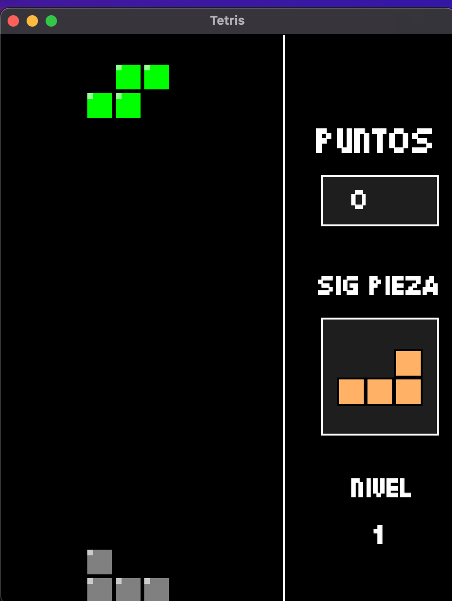

# Tetris

Un juego de **Tetris** clásico desarrollado en **C++** utilizando la biblioteca **SFML**. Disfruta de la experiencia original de Tetris con gráficos modernos, efectos de sonido inmersivos y un sistema de récords para competir contigo mismo.

## Tabla de Contenidos

- [Descripción del Juego](#descripción-del-juego)
- [Características](#características)
- [Controles](#controles)
- [Menús del Juego](#menús-del-juego)
- [Manual de Usuario](#manual-de-usuario)
- [Requisitos del Sistema](#requisitos-del-sistema)
- [Instalación y Configuración](#instalación-y-configuración)
- [Compilación y Ejecución](#compilación-y-ejecución)
- [Instrucciones Específicas para macOS](#instrucciones-específicas-para-macos)
- [Desarrollo](#desarrollo)
- [Solución de Problemas](#solución-de-problemas)

## Descripción del Juego

Tetris es un juego de rompecabezas donde el objetivo es **alinear bloques** de diferentes formas para completar líneas horizontales y obtener la mayor cantidad de **puntos** posible. Las piezas caen desde la parte superior del tablero y debes rotar y posicionar estratégicamente cada pieza para evitar que el tablero se llene.

### Reglas del Juego

- Las **tetrominós** (piezas de 4 bloques) caen desde arriba
- Completa líneas horizontales para eliminarlas y ganar puntos
- El juego termina cuando las piezas alcanzan la parte superior
- Mayor velocidad = mayor puntuación

## Características

- **Jugabilidad clásica de Tetris**: Mecánicas auténticas y fluidas
- **Sistema de récords**: Almacena y muestra los 5 mejores puntajes localmente
- **Banda sonora inmersiva**: Música de fondo y efectos de sonido
- **Interfaz visual moderna**: Gráficos limpios con fuentes personalizadas
- **Sistema de pausa**: Pausa y reanuda en cualquier momento
- **Menú principal interactivo**: Navegación intuitiva entre opciones
- **Pantalla de Game Over**: Visualización de estadísticas finales
- **7 tipos de tetrominós**: Todas las piezas clásicas (I, O, T, S, Z, J, L)
- **Efectos visuales**: Animaciones de líneas completadas con parpadeo
- **Fondo animado**: Piezas de fondo en movimiento en el menú principal

## Controles

### Durante el Juego
| Tecla | Acción |
|-------|--------|
| **A** | Mover pieza hacia la izquierda |
| **D** | Mover pieza hacia la derecha |
| **S** | Acelerar caída de la pieza |
| **W** | Rotar pieza en sentido horario |
| **Q** | Pausar/Reanudar juego |

### En el Menú Principal
| Tecla | Acción |
|-------|--------|
| **W / ↑** | Navegar hacia arriba |
| **S / ↓** | Navegar hacia abajo |
| **Enter** | Seleccionar opción |

### En el Menú de Pausa
| Tecla | Acción |
|-------|--------|
| **Q** | Reanudar juego |
| **R** | Reiniciar partida |
| **M** | Salir del juego |

## Menús del Juego

### Menú Principal
El menú principal incluye las siguientes opciones:
- **Jugar**: Inicia una nueva partida
- **Scores**: Muestra los 5 mejores puntajes guardados
- **Salir**: Cierra el juego

El menú cuenta con:
- Fondo animado con tetrominós cayendo
- Música ambiente específica para el menú
- Navegación con teclas W/S o flechas arriba/abajo
- Efectos visuales para la opción seleccionada

### Menú de Pausa
Durante el juego, presiona **Q** para acceder al menú de pausa con las opciones:
- **[Q] Reanudar**: Continúa la partida actual
- **[R] Reiniciar**: Comienza una nueva partida desde cero
- **[M] SALIR**: Termina el juego y cierra la aplicación

Características del menú de pausa:
- La música se pausa automáticamente
- El estado del juego se mantiene intacto al reanudar
- Reiniciar reproduce un sonido especial de inicio

### Pantalla de Récords
Muestra los 5 mejores puntajes alcanzados, guardados automáticamente en el archivo `record.txt`.

## Manual de Usuario

### Interfaz del Juego

#### Menú Principal
Al iniciar el juego, te encontrarás con el menú principal que presenta una interfaz atractiva con fondo animado:



**Elementos de la interfaz:**
- **Título estilizado**: "TETRIS" en fuente pixel art con efecto 3D
- **Créditos**: "by Fer and Edgar" 
- **Opciones de navegación**:
  - **Jugar**: Comienza una nueva partida
  - **Scores**: Visualiza la tabla de récords
  - **Salir**: Cierra la aplicación
- **Piezas animadas**: Tetrominós cayendo en el fondo para ambiente dinámico

**Cómo usar el menú:**
1. Usa las teclas **W/S** o las **flechas arriba/abajo** para navegar
2. La opción seleccionada se resalta en color amarillo
3. Presiona **Enter** para confirmar tu selección
4. La música de fondo crea un ambiente inmersivo

#### Iniciando una Partida
Para comenzar a jugar, selecciona la opción **"Jugar"** del menú principal:


**Pasos para iniciar:**
1. **Navega** hasta la opción "Jugar" usando las teclas **W/S**
2. **Observa** cómo la opción se resalta en **color amarillo** cuando está seleccionada
3. **Presiona Enter** para confirmar y comenzar una nueva partida
4. **Escucha** el sonido especial de inicio que marca el comienzo del juego
5. **Disfruta** de la transición suave al tablero de juego

Una vez que selecciones "Jugar", el juego:
- Reproduce un efecto de sonido de inicio
- Cambia automáticamente a la vista del tablero de juego
- Inicia la música de fondo del gameplay
- Comienza a generar la primera pieza que caerá

#### Pantalla de Juego
Una vez que inicies una partida, verás la interfaz principal del juego:


**Elementos de la interfaz de juego:**

**Tablero Principal (Centro):**
- **Área de juego**: Tablero de 10x20 donde caen y se posicionan las piezas
- **Fondo negro**: Contraste perfecto para visualizar las piezas de colores
- **Grid invisible**: Las piezas se alinean automáticamente en la cuadrícula

**Panel Lateral Derecho:**
- **Puntos**: Muestra tu puntuación actual que aumenta al completar líneas
- **Nivel**: Indica el nivel de dificultad actual (mayor nivel = mayor velocidad)
- **Pieza Siguiente**: Vista previa de la próxima pieza que caerá, permitiendo planificar tu estrategia

**Información adicional:**
- **Efectos visuales**: Las líneas completadas parpadean antes de desaparecer
- **Indicadores de posición**: La pieza actual se puede mover libremente hasta tocar el suelo o otra pieza
- **Feedback inmediato**: Sonidos diferentes para mover piezas, completar líneas y game over

**Estrategia con el panel lateral:**
1. **Observa la pieza siguiente** para planificar dónde colocar la pieza actual
2. **Monitorea tu puntuación** para seguir tu progreso
3. **Prepárate para el aumento de nivel** que incrementa la velocidad de caída

#### Pantalla de Pausa
Durante cualquier partida, puedes pausar el juego presionando la tecla **Q**. Esto te llevará al menú de pausa:


**Opciones disponibles en pausa:**
- **[Q] Reanudar**: Continúa la partida exactamente donde la dejaste
- **[R] Reiniciar**: Comienza una nueva partida desde cero
- **[M] SALIR**: Termina el juego y regresa al menú principal

**Características del menú de pausa:**
- **Pausa automática de música**: La banda sonora se detiene mientras estás en pausa
- **Estado preservado**: Tu progreso, puntuación y posición de las piezas se mantienen intactos
- **Tiempo ilimitado**: No hay límite de tiempo para permanecer en pausa
- **Efectos de sonido**: Al reanudar o reiniciar se reproducen sonidos especiales

**Cuándo usar la pausa:**
- **Estrategia**: Tómate tu tiempo para planificar tu próximo movimiento
- **Descansos**: Pausa cuando necesites una pausa sin perder tu progreso
- **Emergencias**: Interrupciones inesperadas sin consecuencias en el juego
- **Análisis**: Estudia el tablero y la pieza siguiente sin presión de tiempo

#### Pantalla de Récords
Para ver los mejores puntajes alcanzados, selecciona la opción **"Scores"** del menú principal:


**Visualización de los mejores puntajes:**
- **Top 5 récords**: Muestra los 5 mejores puntajes de todos los tiempos
- **Puntuaciones ordenadas**: De mayor a menor puntuación
- **Persistencia automática**: Los récords se guardan automáticamente en el archivo `record.txt`
- **Histórico completo**: Permite revisar tu progreso y establecer nuevas metas

**Características de la pantalla de récords:**
- **Interfaz clara**: Presentación ordenada y fácil de leer
- **Navegación simple**: Usa **Escape** o **Enter** para regresar al menú principal
- **Actualización automática**: Los nuevos récords se añaden automáticamente al completar una partida
- **Motivación**: Visualiza tus logros y compite contigo mismo

**Cómo establecer un nuevo récord:**
1. **Juega** y trata de conseguir la puntuación más alta posible
2. **Completa líneas múltiples** para obtener más puntos
3. **Sobrevive** a niveles más altos para multiplicar tu puntuación
4. **Al finalizar** la partida, tu puntaje se compara automáticamente con los récords existentes
5. **Si calificas**, tu nuevo récord aparecerá en la lista la próxima vez que veas los "Scores"

#### Durante el Juego
- **Área de juego**: Tablero principal de 10x20 donde caen las piezas
- **Panel lateral**: Muestra puntuación, nivel y vista previa de la siguiente pieza
- **Indicadores visuales**: Efectos de líneas completadas con animación de parpadeo

#### Consejos de Juego
- **Planifica ahead**: Observa la pieza que viene en el panel lateral
- **Elimina líneas múltiples**: Completa varias líneas a la vez para mayor puntuación
- **Usa la pausa**: Presiona **Q** para pausar y pensar tu próximo movimiento
- **Gestiona la velocidad**: A mayor nivel, las piezas caen más rápido

## Requisitos del Sistema

### Sistemas Operativos Soportados
- **Windows** 10/11
- **macOS** 10.15+ (Catalina o superior)

### Herramientas de Desarrollo
- **Compilador C++**: Compatible con C++11 o superior
  - macOS: `clang++` (Xcode Command Line Tools)
  - Windows: `g++` (MinGW) o Visual Studio 2017+
- **Make**: Para ejecutar el sistema de compilación

### Librerías Necesarias
- **SFML 2.5+** (Simple and Fast Multimedia Library)
  - `sfml-graphics`
  - `sfml-window`  
  - `sfml-system`
  - `sfml-audio`

## Instalación y Configuración

### 1. Clonar el Repositorio
```bash
git clone <URL_DEL_REPOSITORIO>
cd Tetris
```

### 2. Instalar Dependencias

#### macOS
```bash
# Usando Homebrew (recomendado)
brew install sfml

# O usando MacPorts
sudo port install sfml +universal
```

#### Windows
1. Descarga SFML desde [sfml-dev.org](https://www.sfml-dev.org/download.php)
2. Extrae en `C:\SFML` o similar
3. Instala MinGW o Visual Studio

## Compilación y Ejecución

### Compilación Rápida
```bash
make
```

### Ejecutar el Juego
```bash
# En macOS
./bin/tetris

# En Windows
./bin/tetris.exe
```

### Comandos del Makefile
```bash
make            # Compilar todo el proyecto
make clean      # Limpiar archivos objeto y ejecutable
make runtetrix  # Compilar y ejecutar automáticamente
```

## Instrucciones Específicas para macOS

### Instalación de Dependencias en macOS

#### Opción 1: Homebrew (Recomendado)
```bash
# Instalar Homebrew si no lo tienes
/bin/bash -c "$(curl -fsSL https://raw.githubusercontent.com/Homebrew/install/HEAD/install.sh)"

# Instalar SFML
brew install sfml

# Verificar instalación
brew list sfml
```

#### Opción 2: Compilar SFML desde el código fuente
```bash
# Descargar SFML
curl -O https://www.sfml-dev.org/files/SFML-2.6.1-sources.zip
unzip SFML-2.6.1-sources.zip
cd SFML-2.6.1

# Compilar e instalar
mkdir build && cd build
cmake .. -DCMAKE_INSTALL_PREFIX=/usr/local
make
sudo make install
```

### Verificación de la Instalación
```bash
# Verificar que g++ esté disponible
g++ --version

# Verificar que SFML esté instalada correctamente
pkg-config --libs sfml-all
```

### Solución de Problemas en macOS

#### Error: "library not found for -lsfml-*"
```bash
# Configurar variables de entorno
export CPPFLAGS="-I/usr/local/include"
export LDFLAGS="-L/usr/local/lib"

# O si usas Homebrew
export CPPFLAGS="-I$(brew --prefix)/include"
export LDFLAGS="-L$(brew --prefix)/lib"
```

#### Permisos de Ejecución
```bash
chmod +x bin/tetris
```

## Desarrollo

### Estructura del Proyecto
```
Tetris/
├── src/                 # Código fuente (.cpp)
├── include/            # Archivos de cabecera (.hpp)
├── assets/             # Recursos del juego
│   ├── fonts/         # Fuentes tipográficas
│   └── music/         # Archivos de audio
├── bin/               # Ejecutables y archivos objeto
├── docs/              # Documentación y diagramas UML
├── makefile           # Sistema de compilación
└── record.txt         # Archivo de récords
```

### Clases Principales
- **`Tetris`**: Clase principal del juego y control de estados
- **`Juego`**: Lógica principal del gameplay
- **`Tablero`**: Gestión del área de juego y detección de líneas
- **`Pieza`**: Representación y manipulación de tetrominós
- **`Audio`** y **`Musica`**: Sistema de sonido
- **`Ventana`**: Gestión de la ventana y renderizado
- **`Puntos`**: Sistema de puntuación y récords

### Compilación de Desarrollo
```bash
# Compilación con información de debug
g++ -std=c++11 -g -Iinclude src/*.cpp -o bin/tetris_debug \
    -lsfml-graphics -lsfml-window -lsfml-system -lsfml-audio

# Verificar dependencias dinámicas (macOS)
otool -L bin/tetris

## Solución de Problemas

### Errores Comunes

#### 1. "SFML not found" o "library not found"
**Solución**:
```bash
# macOS con Homebrew
export PKG_CONFIG_PATH="$(brew --prefix)/lib/pkgconfig"


```

#### 2. "Permission denied" al ejecutar
**Solución**:
```bash
chmod +x bin/tetris
```

#### 3. "No such file or directory: assets/"
**Solución**: Asegúrate de ejecutar desde el directorio raíz del proyecto:
```bash
cd /ruta/al/proyecto/Tetris
./bin/tetris
```

#### 5. Problemas de renderizado en macOS
**Solución**: Actualizar drivers gráficos y verificar compatibilidad con OpenGL:
```bash

### Logs y Debugging
Para obtener información de debug, puedes modificar temporalmente el código para mostrar información adicional o usar herramientas como `gdb`:

```bash
# Ejecutar con gdb
gdb ./bin/tetris
(gdb) run
(gdb) bt  # backtrace en caso de crash
```

### Rendimiento
- El juego está optimizado para 60 FPS
- Uso de memoria típico: ~50MB
- CPU: Mínimo requerido para gráficos 2D

## Archivos Importantes

| Archivo/Directorio | Descripción |
|-------------------|-------------|
| **`src/`** | Código fuente principal del juego (.cpp) |
| **`include/`** | Archivos de cabecera (.hpp) |
| **`assets/fonts/`** | Fuentes tipográficas (Pixel.ttf, tetrominoes.ttf) |
| **`assets/music/`** | Archivos de audio (.ogg) |
| **`bin/`** | Ejecutables y archivos objeto compilados |
| **`docs/`** | Documentación y diagramas UML |
| **`record.txt`** | Archivo donde se almacenan los récords |
| **`makefile`** | Sistema de compilación automatizada |
| **`LICENSE`** | Términos de licencia del proyecto |

## Recursos de Audio

El juego incluye los siguientes efectos de sonido y música:

- **`Tetris.ogg`**: Música principal durante el juego
- **`TetrisMenu.ogg`**: Música del menú principal  
- **`EmpezarJuego.ogg`**: Sonido al iniciar una partida
- **`MovePieza.ogg`**: Efecto al mover piezas
- **`HitPieza.ogg`**: Sonido al colocar una pieza
- **`LineaPunto.ogg`**: Efecto al completar una línea
- **`GameOver.ogg`**: Sonido de fin de partida

## Fuentes Personalizadas

- **`Pixel.ttf`**: Fuente principal con estilo pixel art
- **`tetrominoes.ttf`**: Fuente especial para elementos del juego

## Sistema de Récords

El archivo `record.txt` almacena los 5 mejores puntajes en formato:
```
Puntuación1
Puntuación2
Puntuación3
Puntuación4
Puntuación5
```

## Contribuciones

¡Las contribuciones son bienvenidas! Si deseas mejorar el juego:

1. Fork el repositorio
2. Crea una rama para tu feature (`git checkout -b feature/nueva-caracteristica`)
3. Commit tus cambios (`git commit -am 'Agrega nueva característica'`)
4. Push a la rama (`git push origin feature/nueva-caracteristica`)
5. Crea un Pull Request

## Créditos

**Desarrolladores**: Fer y Edgar

**Librerías utilizadas**:
- [SFML](https://www.sfml-dev.org/) - Simple and Fast Multimedia Library

## Licencia

Este proyecto se distribuye bajo la **Licencia MIT**. Consulta el archivo [`LICENSE`](LICENSE) para más detalles.

---

### ¡Que disfrutes jugando Tetris!

Si encuentras algún problema o tienes sugerencias, no dudes en abrir un [issue](../../issues) en el repositorio.

**¡A por esos récords!**
